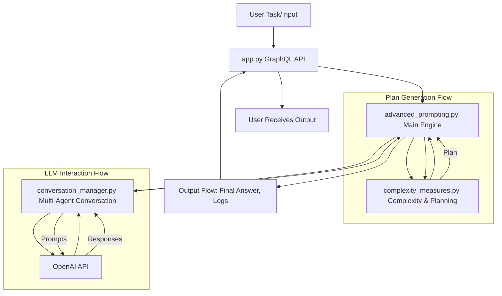

```mermaid
graph TD
    User_Input[User Task/Input] --> A[app.py GraphQL API]
    A --> B[advanced_prompting.py Main Engine]
    B --> C[complexity_measures.py Complexity & Planning]
    C --> B
    B --> D[conversation_manager.py Multi-Agent Conversation]
    D --> OpenAI[OpenAI API]
    OpenAI --> D
    D --> B
    B --> Output_Flow[Output Flow: Final Answer, Logs]
    Output_Flow --> A
    A --> User_Output[User Receives Output]

    subgraph "Plan Generation Flow"
        B --> C
        C -- Plan --> B
    end

    subgraph "LLM Interaction Flow"
        D -- Prompts --> OpenAI
        OpenAI -- Responses --> D
    end
```
