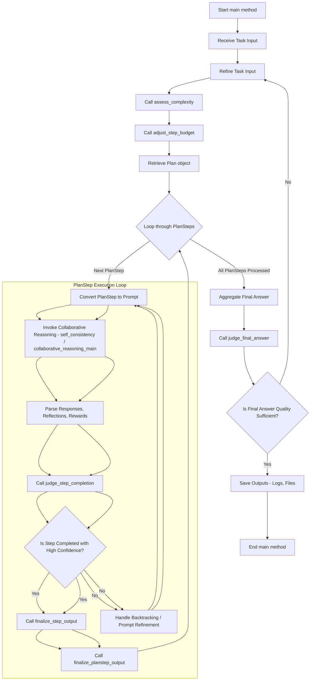

```mermaid
graph TD
    A[Start main method] --> B[Receive Task Input]
    B --> C[Refine Task Input]
    C --> D[Call assess_complexity]
    D --> E[Call adjust_step_budget]
    E --> F[Retrieve Plan object]

    F --> G{Loop through PlanSteps}
    G -->|Next PlanStep| H[Convert PlanStep to Prompt]
    H --> I[Invoke Collaborative Reasoning - self_consistency / collaborative_reasoning_main]
    I --> J[Parse Responses, Reflections, Rewards]
    J --> K[Call judge_step_completion]
    K --> L{Is Step Completed with High Confidence?}
    L -->|Yes| M[Call finalize_step_output]
    M --> N[Call finalize_planstep_output]
    N --> G
    L -->|No| O[Handle Backtracking / Prompt Refinement]
    O --> H

    G -->|All PlanSteps Processed| P[Aggregate Final Answer]
    P --> Q[Call judge_final_answer]
    Q --> R{Is Final Answer Quality Sufficient?}
    R -->|Yes| S[Save Outputs - Logs, Files]
    S --> T[End main method]
    R -->|No| C

    subgraph "PlanStep Execution Loop"
        direction LR
        H --> I --> J --> K --> L
        L -- Yes --> M --> N
        L -- No --> O
        O --> H
    end
```
