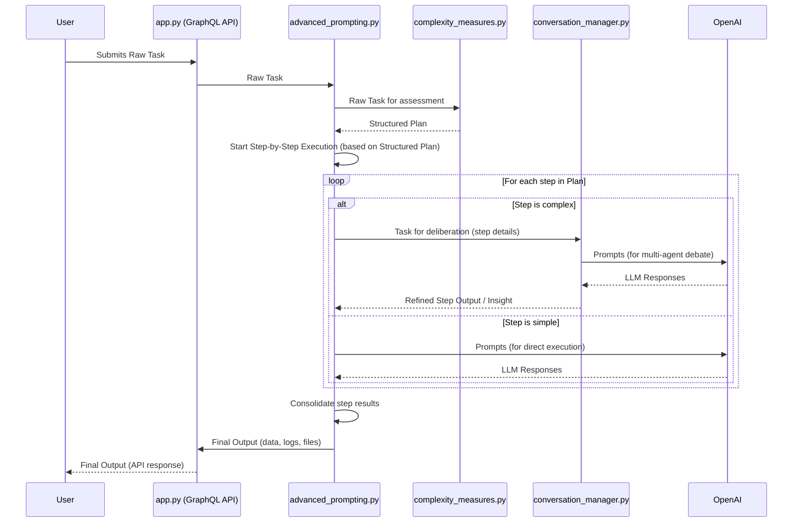

```mermaid
sequenceDiagram
    participant User
    participant API as app.py (GraphQL API)
    participant Engine as advanced_prompting.py
    participant Complexity as complexity_measures.py
    participant ConvManager as conversation_manager.py
    participant OpenAI

    User->>API: Submits Raw Task
    API->>Engine: Raw Task
    Engine->>Complexity: Raw Task for assessment
    Complexity-->>Engine: Structured Plan
    Engine->>Engine: Start Step-by-Step Execution (based on Structured Plan)

    loop For each step in Plan
        alt Step is complex
            Engine->>ConvManager: Task for deliberation (step details)
            ConvManager->>OpenAI: Prompts (for multi-agent debate)
            OpenAI-->>ConvManager: LLM Responses
            ConvManager-->>Engine: Refined Step Output / Insight
        else Step is simple
            Engine->>OpenAI: Prompts (for direct execution)
            OpenAI-->>Engine: LLM Responses
        end
    end

    Engine->>Engine: Consolidate step results
    Engine->>API: Final Output (data, logs, files)
    API-->>User: Final Output (API response)
```
