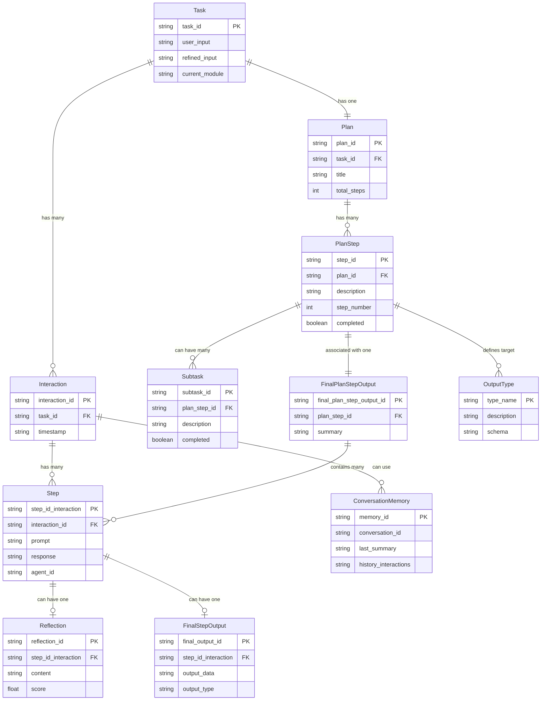

```mermaid
erDiagram
    Task ||--o{ Interaction : "has many"
    Task ||--|| Plan : "has one"
    Task {
        string task_id PK
        string user_input
        string refined_input
        string current_module
    }

    Plan ||--o{ PlanStep : "has many"
    Plan {
        string plan_id PK
        string task_id FK
        string title
        int total_steps
    }

    PlanStep ||--o{ Subtask : "can have many"
    PlanStep ||--|| FinalPlanStepOutput : "associated with one"
    PlanStep ||--o{ OutputType : "defines target"
    PlanStep {
        string step_id PK
        string plan_id FK
        string description
        int step_number
        boolean completed
    }

    Subtask {
        string subtask_id PK
        string plan_step_id FK
        string description
        boolean completed
    }

    Interaction ||--o{ Step : "has many"
    Interaction ||--o{ ConversationMemory : "can use"
    Interaction {
        string interaction_id PK
        string task_id FK
        string timestamp
    }

    Step ||--o| Reflection : "can have one"
    Step ||--o| FinalStepOutput : "can have one"
    Step {
        string step_id_interaction PK
        string interaction_id FK
        string prompt
        string response
        string agent_id
    }

    Reflection {
        string reflection_id PK
        string step_id_interaction FK
        string content
        float score
    }

    FinalStepOutput {
        string final_output_id PK
        string step_id_interaction FK
        string output_data
        string output_type
    }

    FinalPlanStepOutput ||--o{ Step : "contains many"
    FinalPlanStepOutput {
        string final_plan_step_output_id PK
        string plan_step_id FK
        string summary
    }

    ConversationMemory {
        string memory_id PK
        string conversation_id
        string last_summary
        string history_interactions
    }

    OutputType {
        string type_name PK
        string description
        string schema
    }
```
