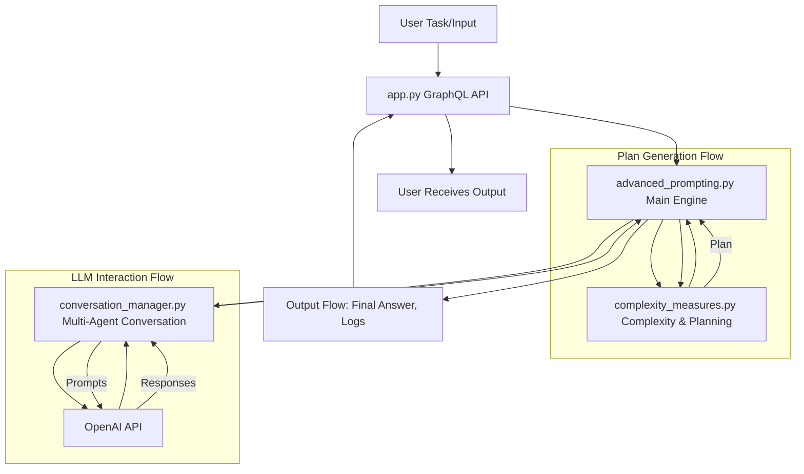
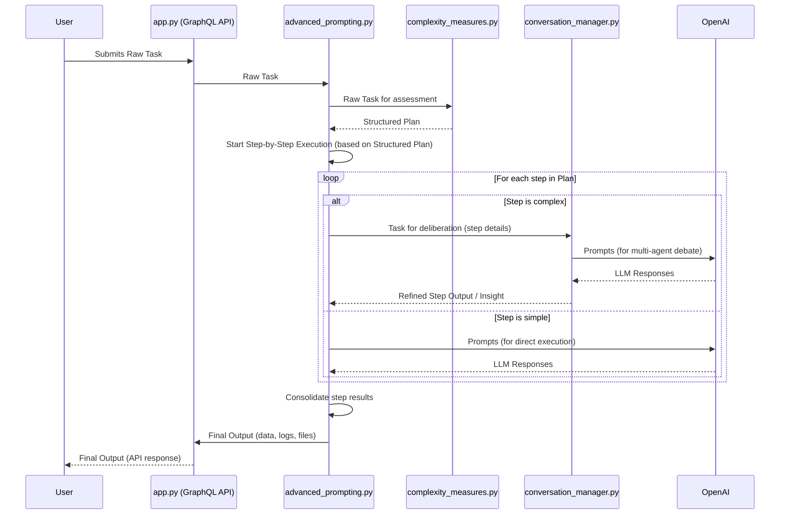

# Final Analysis Report: Advanced Prompting Engine

## 1. Introduction

This report provides a comprehensive analysis of the Advanced Prompting Engine (APE). It includes a deconstructive summary of the engine's purpose, workflow, and key functionalities, along with detailed diagrams illustrating its architecture, data flows, control flows, and core data structures. The aim is to offer a clear understanding of the APE's design and operational principles.

## 2. Deconstructive Analysis Summary

# Deconstructive Analysis Summary of the Advanced Prompting Engine

## 1. Overall Purpose

The Advanced Prompting Engine (APE) is designed to tackle complex tasks by automating the process of understanding, planning, and executing them using Large Language Models (LLMs). Its primary goal is to move beyond simple prompt-response interactions by introducing a structured, multi-step approach to problem-solving. This allows for more reliable, accurate, and sophisticated outputs, especially for tasks that require decomposition, iterative refinement, and potentially collaborative reasoning. The system aims to mimic advanced human problem-solving techniques by breaking down tasks into manageable steps, evaluating progress, and adapting its strategy based on feedback and confidence scores.

## 2. Core Logic/Workflow

The engine processes tasks through a sophisticated pipeline:

*   **Task Input & Initial Refinement**: A user submits a task, typically via a GraphQL API endpoint managed by `app.py`. The initial input may undergo a refinement process to ensure clarity and suitability for the engine.

*   **Planning Phase (`complexity_measures.py`)**:
    *   Once the task is defined, it's passed to the `complexity_measures.py` module.
    *   This module assesses the task's complexity, potentially using LLM assistance.
    *   Based on this assessment, it generates a `Plan` object. This `Plan` consists of a sequence of `PlanStep`s, where each step represents a smaller, manageable part of the overall task.
    *   The module also helps in `adjust_step_budget`, determining the resources or iterations allocated for each step.

*   **Execution Phase (`advanced_prompting.py`)**:
    *   The `advanced_prompting.py` module, specifically the `AdvancedPromptEngineer.main` method, orchestrates the execution of the `Plan`.
    *   **Step-by-Step Processing**: It iterates through each `PlanStep`:
        *   The `PlanStep` is converted into one or more prompts for the LLM.
        *   It invokes a reasoning process, which could be a simple LLM call, or more advanced techniques like `self_consistency` (generating multiple responses and picking the best) or triggering a multi-agent conversation for very complex steps.
        *   **Reflections & Rewards**: After an LLM response, the system might generate `Reflections` (meta-analysis of the response quality) and `Rewards` (scores indicating how well the step's goal was met).
        *   **Confidence Handling**: The engine uses `judge_step_completion` to evaluate if a step is completed with sufficient confidence (based on reflections, rewards, or other metrics).
        *   If confidence is low, the system may engage in **backtracking** (revisiting a previous step), **prompt refinement** (modifying the prompt for the current step), or allocate more resources.
        *   Once a step is completed satisfactorily, its output (`FinalStepOutput`, `FinalPlanStepOutput`) is stored.

*   **Multi-Agent Conversation (`conversation_manager.py`)**:
    *   For `PlanStep`s deemed highly complex or requiring diverse perspectives, the `advanced_prompting.py` module can delegate the task to the `conversation_manager.py`.
    *   The `ConversationManager` facilitates a structured debate or discussion among multiple virtual "assistant" agents (instantiated LLM interactions with different roles or perspectives).
    *   This involves rounds of discussion, summarization, calculating assistant priorities, mediator guidance, and potentially voting mechanisms to reach a consensus or a more robust solution for that specific step.
    *   The output from the conversation manager is then fed back into the main execution flow.

*   **Final Output Aggregation & Judging**: After all `PlanStep`s are processed, the engine aggregates the results into a final answer. The `judge_final_answer` function assesses the overall quality. If insufficient, it might trigger further refinement or even loop back to an earlier phase.
*   **Output Delivery**: The final, validated output, along with any logs or generated files, is returned to the user, typically via the API.

## 3. Key Functionalities

*   **Automated Problem Decomposition and Planning**: The engine automatically breaks down complex user tasks into a structured sequence of smaller, manageable steps (`Plan` and `PlanStep`s) via `complexity_measures.py`.
*   **Iterative Solution Refinement**:
    *   Employs techniques like `self_consistency` where multiple solutions are generated and evaluated.
    *   Uses `Reflections` and `Rewards` to assess the quality of LLM outputs at each step.
    *   Supports backtracking to previous steps or refining prompts if confidence in a step's output is low.
*   **Multi-Agent Collaboration**: For highly complex problems, it can invoke a multi-agent conversational system (`conversation_manager.py`) where different LLM-powered "agents" collaborate, debate, and refine solutions.
*   **Structured Output Generation**: The system is designed to produce outputs in various predefined formats (`OutputType`), potentially including text, code, data structures (like JSON), or files. This is often guided by `schema.py` which defines the data models.

## 4. Component Interactions

*   **`app.py`**: Serves as the entry point, typically a GraphQL API. It receives user requests, passes them to the `advanced_prompting.py` for processing, and returns the final output.
*   **`schema.py`**: Defines the Pydantic data models (e.g., `Task`, `Plan`, `PlanStep`, `Interaction`, `Step`, `Reflection`, `OutputType`) used throughout the system for structured data handling. These models ensure consistency in how data is passed between components.
*   **`advanced_prompting.py` (Main Engine)**: Orchestrates the overall task execution. It uses `complexity_measures.py` for planning and may call `conversation_manager.py` for complex steps. It interacts heavily with the OpenAI API to execute individual plan steps.
*   **`complexity_measures.py`**: Responsible for analyzing the initial task, decomposing it into a plan (list of `PlanStep`s), and potentially adjusting resource budgets for each step. It interacts with the OpenAI API for its assessment.
*   **`conversation_manager.py`**: Manages multi-agent discussions. It takes a sub-problem (often a complex `PlanStep`), defines roles for different LLM agents, and facilitates their interaction to produce a refined solution. It relies on the OpenAI API to power these agents.
*   **OpenAI API**: This is the external LLM provider. All components that need to generate text, code, plans, reflections, or simulate agent responses interact with the OpenAI API by sending prompts and receiving completions.

## 5. Data Management

Key data structures, typically defined as Pydantic models in `schema.py`, are crucial for the engine's operation:

*   **`Task`**: Stores the initial user request, any refined version of it, and tracks the overall state. It's the root object that initiates a processing job.
*   **`Plan`**: Represents the structured breakdown of a `Task`. It contains a title and a list of `PlanStep`s. `Task` has one `Plan`.
*   **`PlanStep`**: Details an individual step within a `Plan`, including its description, number, and completion status. `Plan` has many `PlanStep`s.
*   **`Interaction`**: Often used to log a sequence of operations or exchanges, possibly related to a `Task` or a specific part of the multi-agent conversation. A `Task` can have many `Interaction`s.
*   **`Step`**: Represents a single prompt-response cycle within an `Interaction` or `FinalPlanStepOutput`. It includes the prompt, response, and potentially the agent ID. An `Interaction` or `FinalPlanStepOutput` can have many `Step`s.
*   **`Reflection`**: Stores the analysis or score of a `Step`'s output, used for quality assessment and iterative refinement. A `Step` can have one `Reflection`.
*   **`ConversationMemory`**: Used by `conversation_manager.py` to maintain the state and history of a multi-agent discussion, including summaries and past interactions.
*   **`FinalStepOutput` / `FinalPlanStepOutput`**: Store the validated and finalized output for a particular `Step` or `PlanStep` respectively.

These structures are interconnected: a `Task` leads to a `Plan`, which is composed of `PlanStep`s. Each `PlanStep`'s execution might involve multiple `Interaction`s or `Step`s, each potentially generating `Reflection`s and culminating in a `FinalPlanStepOutput`. This structured data flow allows the engine to manage complex processes, track progress, and facilitate iterative refinement.

## 3. System Architecture Diagram



## 4. Data Flow Diagram for Task Processing



## 5. Control Flow Diagram for `AdvancedPromptEngineer.main`

```mermaid
graph TD
    A[Start main method] --> B[Receive Task Input];
    B --> C[Refine Task Input];
    C --> D[Call assess_complexity];
    D --> E[Call adjust_step_budget];
    E --> F[Retrieve Plan object];

    F --> G{Loop through PlanSteps};
    G -- Next PlanStep --> H[Convert PlanStep to Prompt];
    H --> I[Invoke Collaborative Reasoning (e.g., self_consistency / collaborative_reasoning_main)];
    I --> J[Parse Responses, Reflections, Rewards];
    J --> K[Call judge_step_completion];
    K --> L{Is Step Completed with High Confidence?};
    L -- Yes --> M[Call finalize_step_output];
    M --> N[Call finalize_planstep_output];
    N --> G;
    L -- No --> O[Handle Backtracking / Prompt Refinement];
    O --> H; 

    G -- All PlanSteps Processed --> P[Aggregate Final Answer];
    P --> Q[Call judge_final_answer];
    Q --> R{Is Final Answer Quality Sufficient?};
    R -- Yes --> S[Save Outputs (Logs, Files)];
    S --> T[End main method];
    R -- No --> C;  // Or potentially to a more targeted refinement step

    subgraph "PlanStep Execution Loop"
        direction LR
        H --> I --> J --> K --> L
        L -- Yes --> M --> N
        L -- No --> O
        O --> H
    end
```

## 6. Control Flow Diagram for `conversation_manager.run_conversation`

```mermaid
graph TD
    A[Start run_conversation] --> B[Initial Problem Statement Input];
    B --> C[Consensus on Problem Definition (define_problem)];
    C --> D[Output Type Determination (output_type_determination)];

    D --> E{Main Conversation Loop (Rounds)};
    E -- Next Round --> F[Summarize Previous Round (if applicable)];
    F --> G[Calculate Assistant Priorities];
    G --> H[Mediator Guides Discussion for Current Round];

    H --> I{Loop Through Prioritized Assistants};
    I -- Next Assistant --> J[Get Assistant Response (get_assistant_response)];
    J --> K[Extract Information into ConversationMemory (extract_information)];
    K --> L[Handle Socratic Questions / Direct Replies];
    L --> I; 

    I -- All Assistants Processed for Round --> M[Analyze to_do_list Completion (analyze_to_do_list)];
    M --> N[Mediator Summarizes Round];
    N --> O{Voting: Continue or End Conversation?};
    O -- Continue --> E; 

    O -- End Conversation --> P[Final Decision/Solution Generation by Designated Assistant];
    P --> Q[Final Output Generation using Function Calling (finalize_output)];
    Q --> R[Iterative Refinement of Final Output (analyze_final_output)];
    R --> S{Is Output Sufficient?};
    S -- Yes --> T[End run_conversation];
    S -- No --> Q;

    subgraph "Conversation Round"
        direction LR
        F --> G --> H --> I
        I -- Next Assistant --> J --> K --> L
        L --> I
        I -- All Assistants Processed --> M --> N --> O
    end
```

## 7. Entity-Relationship Diagram (ERD) for Core Data Structures

```mermaid
erDiagram
    Task ||--o{ Interaction : "has many"
    Task ||--|| Plan : "has one"
    Task {
        string task_id
        string user_input
        string refined_input
        string current_module
    }

    Plan ||--o{ PlanStep : "has many"
    Plan {
        string plan_id
        string task_id
        string title
        int total_steps
    }

    PlanStep ||--o{ Subtask : "can have many"
    PlanStep ||--o{ FinalPlanStepOutput : "associated with one"
    PlanStep {
        string step_id
        string plan_id
        string description
        int step_number
        bool completed
    }

    Subtask {
        string subtask_id
        string plan_step_id
        string description
        bool completed
    }

    Interaction ||--o{ Step : "has many"
    Interaction {
        string interaction_id
        string task_id
        string timestamp
    }

    Step ||--o{ Reflection : "can have one"
    Step ||--o{ FinalStepOutput : "can have one"
    Step {
        string step_id_interaction  // Renamed to avoid conflict with PlanStep's step_id
        string interaction_id
        string prompt
        string response
        string agent_id
    }

    Reflection {
        string reflection_id
        string step_id_interaction
        string content
        float score
    }

    FinalStepOutput {
        string final_output_id
        string step_id_interaction
        string output_data
        string output_type
    }

    FinalPlanStepOutput ||--o{ Step : "contains many"
    FinalPlanStepOutput {
        string final_plan_step_output_id
        string plan_step_id
        string summary
    }

    ConversationMemory {
        string memory_id
        string conversation_id
        string last_summary
        list history_interactions
    }

    OutputType {
        string type_name
        string description
        string schema  // e.g., JSON schema
    }

    Interaction ||--o{ ConversationMemory : "can use"
    PlanStep ||--o{ OutputType : "defines target"

```

## 8. Conclusion

This report has detailed the architecture, workflows, and data structures of the Advanced Prompting Engine. The deconstructive analysis and accompanying diagrams illustrate a robust system designed for complex task processing through automated planning, iterative refinement, and collaborative reasoning with LLMs. The modular design allows for sophisticated interactions between components, aiming to deliver high-quality, structured outputs.
